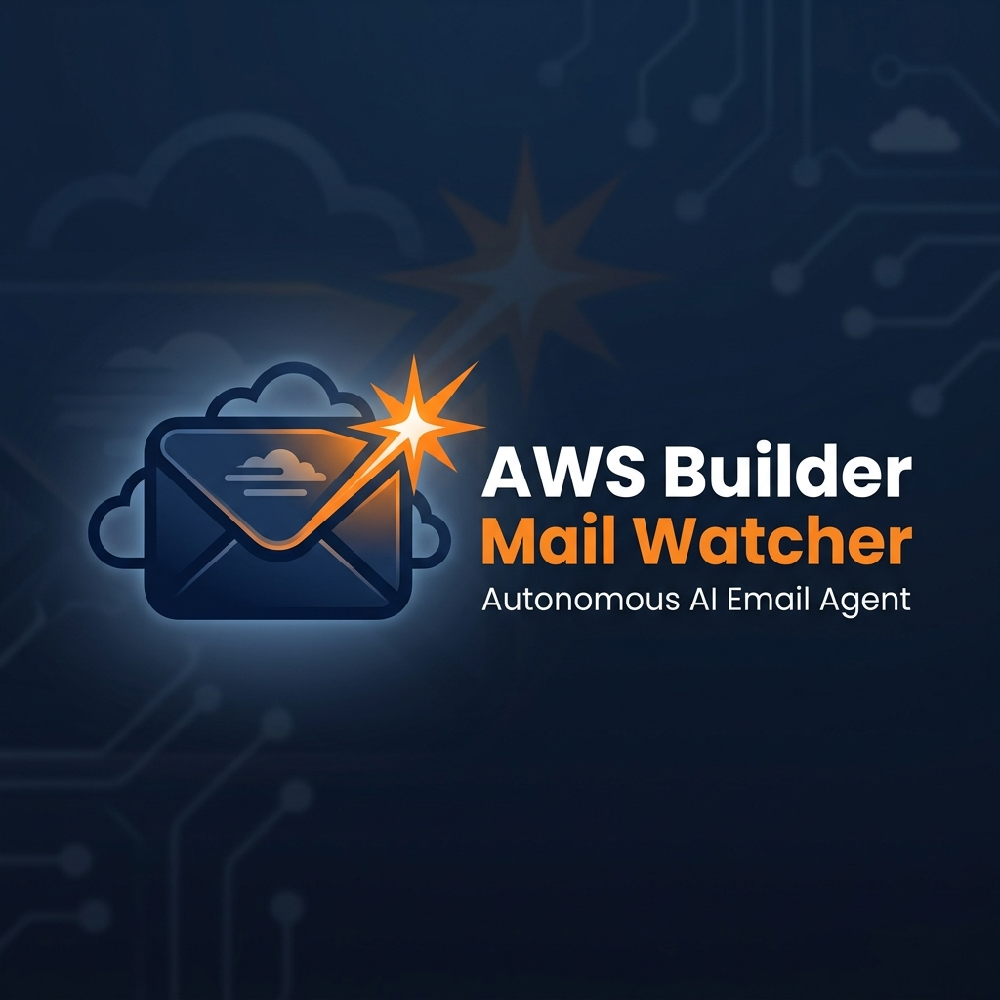
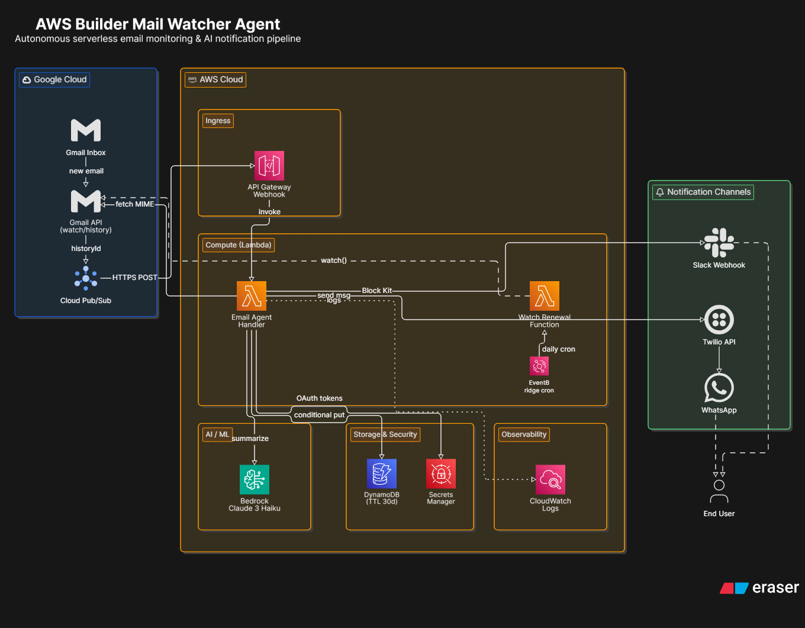
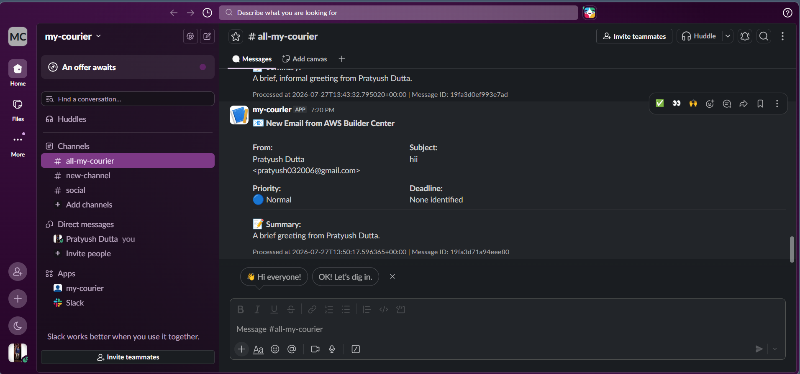
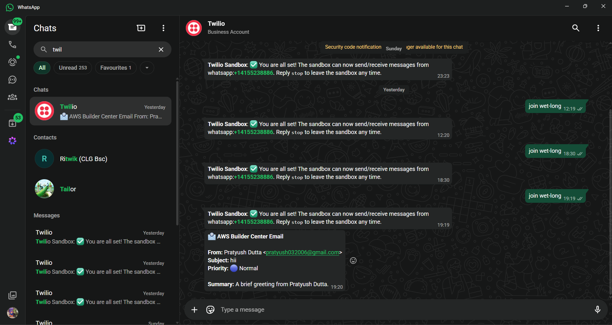

<div align="center">
  
  
  # AWS Builder Mail Watcher Agent
  
  **An autonomous, AI-powered, serverless email notification agent built on AWS.**
</div>

---

## 📖 Overview

The **AWS Builder Mail Watcher Agent** is a fully serverless, event-driven application. Its primary goal is to autonomously monitor a specific Gmail inbox, filter incoming emails based on a strict allowed senders list, use Generative AI to extract and summarize key metadata (priority, deadlines, action items), and notify the user across multiple channels (Slack and WhatsApp) while ensuring zero duplicate notifications.

This project is built following strict software engineering best practices, emphasizing modularity, resilience, and observability.

---

## 🏗 System Architecture

The agent is powered by a robust combination of Google Cloud Platform (GCP) and Amazon Web Services (AWS). 

<div align="center">
  
</div>

### Core Services:
- **Google Cloud Platform**: Gmail API (History & Messages), Google Cloud Pub/Sub
- **AWS Serverless Compute**: Amazon API Gateway, AWS Lambda
- **AWS AI/ML**: Amazon Bedrock (Anthropic Claude 3 Haiku / 3.5 Sonnet)
- **AWS Storage & Security**: Amazon DynamoDB, AWS Secrets Manager
- **AWS Event Management**: Amazon EventBridge
- **External APIs**: Slack (Incoming Webhooks), Twilio (WhatsApp API)

---

## 🔄 End-to-End Workflow

### Phase A: Event Trigger & Ingestion
1. **Email Arrival**: A new email arrives in the monitored Gmail inbox.
2. **Gmail Watch Trigger**: Gmail API detects the change and pushes a JSON notification containing a `historyId` to a Google Cloud Pub/Sub Topic.
3. **Push Subscription**: Google Cloud Pub/Sub pushes this payload via HTTPS POST to an Amazon API Gateway webhook endpoint.

### Phase B: Orchestration & Email Retrieval (AWS Lambda)
4. **Lambda Invocation**: API Gateway triggers the core **Email Agent Handler Lambda**.
5. **Secret Retrieval**: The Lambda securely fetches Gmail OAuth tokens from AWS Secrets Manager (caching them for warm starts).
6. **Delta Fetching**: The Lambda uses the Gmail History API to determine exactly which messages are new. It includes a fallback mechanism to `messages.list(is:unread)` to ensure zero dropped messages during rapid sequential events.
7. **Email Download**: The Lambda fetches the full MIME payload via the Gmail API.

### Phase C: Filtering & AI Processing
8. **Sender Validation**: The Lambda parses the email headers and checks the sender against an environment-injected allow-list. Unauthorized emails are immediately dropped.
9. **Generative AI Summarization**: The raw email body is stripped of HTML and sent to Amazon Bedrock. The LLM is strictly prompted to output structured JSON containing the email's Priority, Summary, Action Items, and Deadlines.

### Phase D: Storage & Atomic Deduplication
10. **Atomic Write**: The Lambda attempts to save the structured email data to Amazon DynamoDB using a conditional write (`attribute_not_exists(message_id)`). This guarantees idempotency—if a race condition occurs, the second write fails, preventing duplicate downstream notifications. Records are automatically cleaned up after 30 days via DynamoDB TTL.

### Phase E: Multi-Channel Notification
11. **Slack Alert**: The AI summary is formatted into rich UI blocks (Slack Block Kit) and pushed via an Incoming Webhook to Slack.
12. **WhatsApp Alert**: A mobile-friendly text version of the summary is sent via the Twilio Messaging API to the user's WhatsApp number.

### Phase F: Maintenance
13. **Watch Renewal**: Google's Gmail `watch()` expires every 7 days. An Amazon EventBridge cron rule triggers a secondary Lambda function every day to continuously renew the Push subscription.

---

## 🛡️ Security & Configuration
- **Infrastructure as Code (IaC)**: Deployed using AWS Serverless Application Model (SAM).
- **Environment Variables**: Infrastructure parameters (Region, DynamoDB Table, Bedrock Model ID) are passed as Lambda environment variables.
- **Secrets Management**: Sensitive credentials (OAuth tokens, Webhook URLs, Twilio Auth Tokens) are strictly maintained in **AWS Secrets Manager**.
- **Least Privilege IAM**: The Lambda execution roles are tightly scoped to only allow necessary actions (`dynamodb:PutItem`, `secretsmanager:GetSecretValue`, `bedrock:InvokeModel`).

---

## ⚡ Error Handling & Resilience
- **Exponential Backoff**: All external API calls (Gmail, Bedrock, Twilio, Slack) are wrapped in a custom `@retry` decorator utilizing exponential backoff.
- **Fail-Safe HTTP Responses**: The Lambda always returns HTTP 200 to API Gateway (even on internal logic failures) to prevent Google Pub/Sub from entering aggressive infinite retry loops.
- **Structured Logging**: All events are logged to Amazon CloudWatch using structured JSON formatting, making it easy to query via CloudWatch Logs Insights.

---

## 📸 Demo — Live Notifications

The following are real notifications generated by the agent when processing an incoming email.

### Slack Notification (Block Kit)
<div align="center">
  
</div>

The Slack alert includes the sender, subject, AI-assessed priority, deadline, and a one-line summary — all formatted using Slack's Block Kit for a clean, scannable layout.

### WhatsApp Notification (Twilio)
<div align="center">
  
</div>

The WhatsApp alert is formatted for mobile readability — same metadata, optimised for quick glance on the go.

---

## 🚀 Getting Started

### Prerequisites
- AWS CLI & AWS SAM CLI installed
- Docker (for SAM build)
- Google Cloud Project (with Gmail API & Pub/Sub enabled)
- Slack App with Incoming Webhooks enabled
- Twilio Account for WhatsApp sandbox

### Deployment
1. Configure AWS CLI with your credentials.
2. Complete the local Gmail OAuth flow to generate `token.json` and `credentials.json`.
3. Store the credentials in AWS Secrets Manager:
   - `email-agent/gmail-credentials`
   - `email-agent/slack`
   - `email-agent/twilio`
4. Build and deploy using AWS SAM:
   ```bash
   cd email-agent/infrastructure
   sam build
   sam deploy --guided
   ```
5. Configure the Google Cloud Pub/Sub Push Subscription with the output API Gateway URL.
6. Register the initial Gmail watch to start receiving events.

---

*Built with ❤️ for the AWS Builder Center.*
